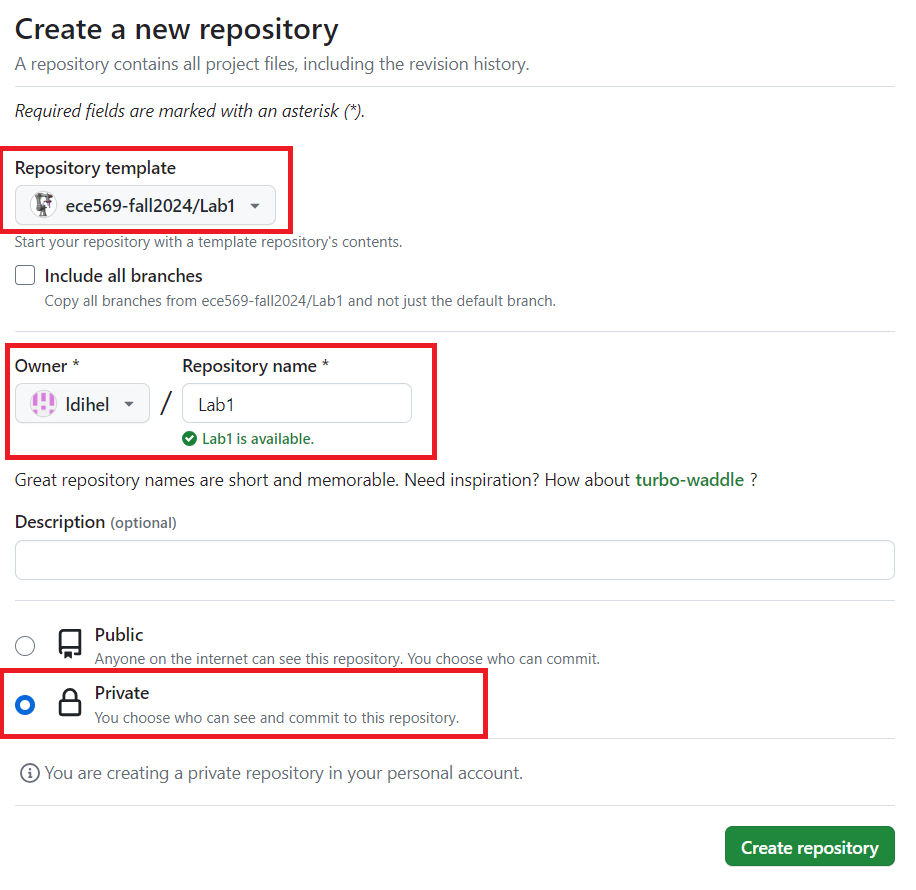
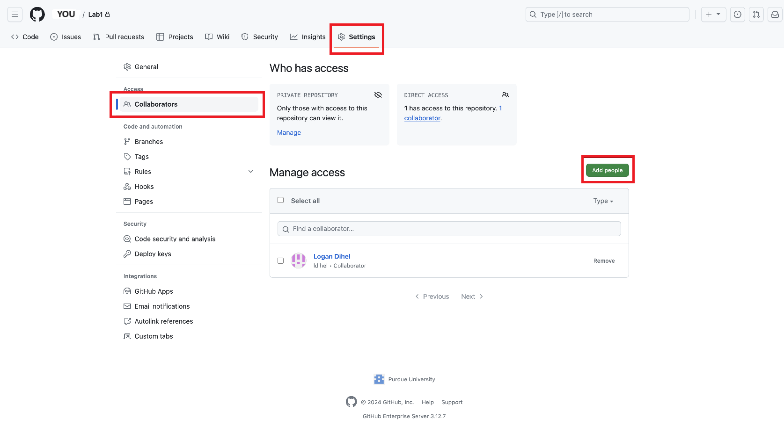
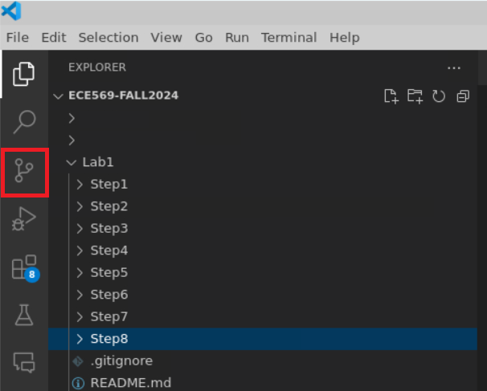

# Step 1: Setting Up Your Enivornment on eceprog

Hello! If you are reading this, you have been added to the `ece569-fall2024` organization, and you are ready to complete Lab 1. Please follow along with the rest of the tutorial. If you have questions, you can use Piazza, or talk to your TA (Logan) during office hours.

### Opening the Terminal
Once connected to eceprog, right-click on the desktop background and press `Open Terminal Here`. Now run:
```bash
mkdir -p ~/ece569-fall2024
```
*Note: this course will require the use of the Ubuntu terminal. If you are unfamiliar with a command or any of its flags (such as `-p`), you can add a `--help` flag to the end of the command, or run `man <your command>` to view the manual's entry for that command, if it exists. For example, you can run `man mkdir` to find out more.  Please note that ChatGPT can be useful for explaining common commands, but the results can be inaccurate or misleading; use at your own risk.*

### Setup Github
You will need to setup an SSH key to access Github on eceprog. Try following the instructions below first. Additional instructions are provided [here](https://docs.github.com/en/authentication/connecting-to-github-with-ssh/generating-a-new-ssh-key-and-adding-it-to-the-ssh-agent) and [here](https://docs.github.com/en/authentication/connecting-to-github-with-ssh/adding-a-new-ssh-key-to-your-github-account#adding-a-new-ssh-key-to-your-account) if you get stuck. 

Open a new terminal and run the following (replacing `your_email` with the email associated with your Purdue github account):
```bash
ssh-keygen -t ed25519 -C "your_email@purdue.edu"
```
When prompted with "Enter a file in which to save the key", just press `Enter` to accept the default file location. Forthe passphrase, just press `Enter` twice for an empty passphrase.

1. Open the file you created in VSCode
    ```bash
    code ~/.ssh/id_ed25519.pub
    ```
    and then copy the SSH public key to your clipboard. (You can do this with `Ctrl+A`, `Ctrl+C`.)
2. Go to any page on GitHub, click on your profile photo, and click `Settings`. 
3. Under `Access` section of the sidebar, click `SSH and GPG keys`. 
4. Click `New SSH key`
5. In the `Title` field, enter something descriptive such as `eceprog`.
6. Paste your publickey into the "Key" field.
7. Click `Add SSH Key`


Now, you need to set your github name and email. From any terminal (on eceprog), run:
```
git config --global user.name "Your First and Last Name"
git config --global user.email "your_email@purdue.edu"
```
_Be sure to replace your name and email with your actual name and email._

### Duplicate the Lab 1 Repository
In order to complete Lab 1, you will need to duplicate this repository. Go to [this link](https://github.itap.purdue.edu/ece569-fall2024/Lab1) and then click the green `Use the template` button in the top right corner. On the next page, be sure to set the `Owner` to your username, and the `Repository Name` to `Lab1`. See the screenshot below for details. Finally, press `Create repository`. Your own repository should be created in a few seconds.



Once your repository has been created, go to its `Settings -> Collaborators` and click the green `Add people` button and then add `ldihel`. 



### Clone Your Repository
In your browser, return to your Lab1 repository's main page. Click the green `Code` button, select the `SSH` option, and then click the copy button (two overlapping gray squares). In eceprog, start a new terminal window and run:
```bash
cd ~/ece569-fall2024
git clone <paste your clipboard here with Ctrl+Shift+V>
```
_Note: as a general rule of thumb with terminal instructions, you never include the angled brackets `< >` in your commands unless specified otherwise_. Your repository should now be inside the `ece569-fall2024` folder, and you should have read/write access.

### Testing Write Access
Open the repository in VSCode by running:
```bash
code Lab1
```
Then, update the README.md file inside the `ece569-fall2024/Lab1` folder to include your name and email:
```
Name: `your name here`
Email: `your email here`
```
In the left window, click the `Source Control` button (looks like three dots connected by lines; it may a small blue circle near it) or press `Ctrl+Shift+G`.



_Note: if you don't see anything in source control, try closing and then re-openning VSCode to refresh it. If this still doesn't work, navigate to your newly downloaded `Lab1` folder, and then run `git remote -v` and verify that the URL is something like `git@github.itap.purdue.edu:<your_username>/Lab1.git`. Reach out on Piazza for further help if you get stuck._

Add the changes by putting your mouse cursor over `Changes` and pressing the `+` button. Then type a message in the textbox above, and press `Commit`. Then in the botton left corner of VSCode, you can press the `1↑` button to sync your changes with the remote repository on github. 

Visit the your Lab1 repository in a web browser, and hit the refresh button. Verify that the `README.md` file now contains your name and email.

### VSCode Extensions
All of our code for `Lab1` will live in the `ece569-fall2024/Lab1`, which should be open in VSCode now. You can open a new terminal within VSCode by pressing `Ctrl+Shift+~`. I also recommend (but don't require) installing some useful extensions:
* CMake (twxs)
* CMake Tools (Microsoft)
* XML (Red Hat)
* Python

The extensions menu can be brought up by pressing `Ctrl+Shift+X` or simply clicking on the `Extensions` button (looks like 4 squares) on the far left side of your VSCode window.

I also (strongly) recommend you enable autosave (click `File > Auto Save`) from the drop down menu on the top left corner of your VSCode window. This will save you a lot of frustration down the road.

## ROS Setup
This course will require the use of ROS (Robot Operating System), which is an open-source collection of software packages and tools designed for building, testing, and simulating robots. You will learn a lot about ROS in this course. For now, do the following:
```bash
code ~/.bashrc
```
This will open the `.bashrc` file located in the your home directory. This is a special executable file which is automatically run when a new terminal window is opened by you. Paste the following line of code at the bottom of your `.bashrc` file:
```bash
source /opt/ros/humble/setup.bash
```
This will allow each new terminal window you open to recognize ROS commands. Close your `~/.bashrc` file. Close your current terminal with `Ctrl+D`, and open a new one with `Ctrl+Shift+~`. 

### Setup RosTeamWorkspace Tools
These scripts are useful for our future work developing ROS packages. For now, do the following:
```bash
cd ~/ece569-fall2024
git clone https://github.com/StoglRobotics/ros_team_workspace.git
source ros_team_workspace/setup.bash
setup-auto-sourcing
```
follow the prompts with `yes` responses. Close your current terminal with `Ctrl+D`, and open a new one with `Ctrl+Shift+~`. Now open your `.bashrc` file again:
```bash
code ~/.bashrc
```
and you should see the following lines added to your `.bashrc` file:
```bash
# automatically source RosTeamWorkspace if the .ros_team_ws file is present in your home folder.
if [ -f ~/.ros_team_ws_rc ]; then
    . ~/.ros_team_ws_rc
fi
```
We need to make one modification to your `.ros_team_ws_rc` file. Open the file with
```bash
code ~/.ros_team_ws_rc
```
and then on line 22 (the one that says `export ROS_DOMAIN_ID=0`), replace the entire line with:
```bash
. /home/shay/a/ece569/.scripts/assign-ros-ids.sh
```
This will run a custom script written by your TA `ldihel`, which will dynamically assign you a `ROS_DOMAIN_ID` when you open a new terminal.

Close your terminal now, and open a new one. The script will run and output your `ROS_DOMAIN_ID`. You can always open a new terminal window and verify that 
```bash
echo $ROS_DOMAIN_ID
```
prints your domain ID (an integer between 10 and 101, inclusive).

### Why ROS_DOMAIN_ID?
In short, each student needs to have a unique `ROS_DOMAIN_ID` in order to prevent one student's ROS instance from talking with another. The ROS domain IDs 0-9 have been reserved for other students (not in ECE 569) on eceprog, while domain IDs 10-101 have been reserved for ECE 569 students. The custom script will dynamically assign you a unique domain ID.

## Next Steps
Proceed to [Step 2](/Step2/README.md)
